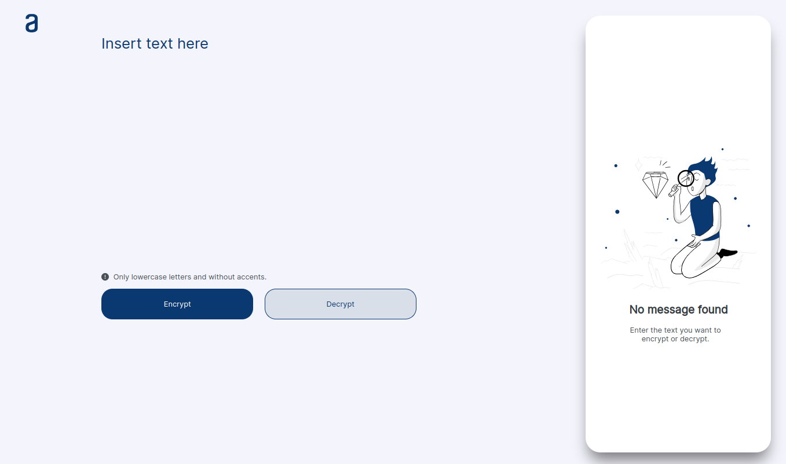

# Challenge ONE Oracle + Alura

Implementation of the first challenge: a Text Decoder in JavaScript. The development was carried out according to the prototype provided.

##

Access [https://renataigarashi.github.io/challenge-ONE-js-encryptor/](https://renataigarashi.github.io/challenge-ONE-js-encryptor/) to view the application.

   

Coded together by

[Mariana Trombini](https://www.linkedin.com/in/mariana--trombini/) |
[Renata Igarashi](https://www.linkedin.com/in/renata-igarashi/)
